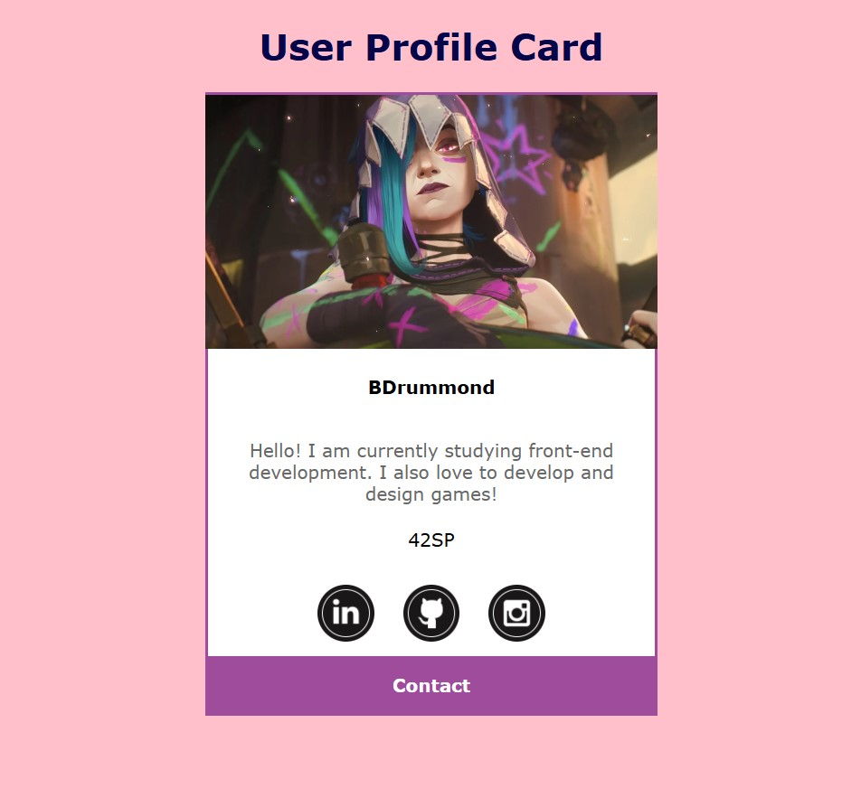

<h1 align="center" style="font-weight: bold;">🌌 42 São Paulo Discovery Piscine - Web Development</h1>

<p align="center">
 <a href="#technologies">Technologies</a> • 
 <a href="#started">Getting Started</a> •   
 <a href="#struct">Project Structure</a> •
 <a href="#contribute">Contribute</a>
</p>

<p align="center">
    Web projects developed during the discovery piscine of 42 São Paulo. Discovery piscine is an immersive week to learn the basics of Web Development and the École 42 methodology.
</p>

<h2 id="technologies">💻 Technologies</h2>

- Shell
- HTML
- CSS
- JavaScript
- jQuery

<h2 id="started">🚀 Getting started</h2>

- It's not recommended that you clone this repository unless you have participated in the immersion or intend to study the contents.

- In order to clone this repository, you need to define the path/location where it will be cloned using your terminal tool. Then, just paste the code:

```bash
git clone https://github.com/BabiDrummond/42_discovery_piscine.git
```

- To open the exercises, simply launch the files `.html` in your favorite browser 🌐.


<h2 id="struct">🧩 Project Structure</h2>

* [x] **Cell00:** Introduction to Shell
* [x] **Cell01:** Basic Web Development
* [x] **Cell02:** Advanced CSS and Visual Effects
* [x] **Cell03:** JavaScript Interactivity and Effects
* [x] **Rush:** One-Page Mini Site (Portfolio)

<h3>🔥 Preview of Some Projects</h3>

<div style="display: flex; justify-content: space-around; align-items: center;">
  
  
</div>

<div style="display: flex; justify-content: space-around; align-items: center;">
  
  
</div>

<div style="display: flex; justify-content: space-around; align-items: center;">
  
  
</div>

<h2 id="contribute">📫 Contribute</h2>

This repository is only a personal study, but feel free to reuse the content.